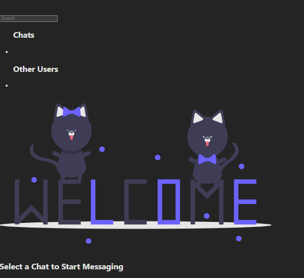

# ChatRat
A social Messaging app for chatting.

  ## Table of Contents
- [Description](#description)
- [Installation](#installation)
- [Usage](#usage)
- [Credits](#credits)
- [License](#license)
- [Contributing](#contributing)
- [Tests](#tests)
- [Questions](#questions)

## Description 

 This project was created with the motivation to show our skills as developers. We built this project as a means to connect people in real time through online messaging. We solved many problem of routing files to connect the front end to the back end. We learned what it take to build a MERN stacked application.

## Installation
Make sure your modules are installed by running **npm i** in the chat-rat directory so that node modules are populated on your local machine.

## Usage
Usage Image:

Sign up through our sign up page, and once you have a login, simply use those new credentials and start exploring. 

## Credits
Collaborator Github Links:

Abdul A:

Bret Kruse: https://github.com/BretKruse

Eduardo Perez (Repo Owner): https://github.com/Kanabaki

Isaiah Waddington: https://github.com/Isaiahw01

Jack Elam: https://github.com/Jackelam20

## License
License: MIT

## Contributing 
Go to the Questions section for more info.

## Tests 
No tests at this time.

## Questions 
If you have questions regarding the app or if you'd like to contribute, you can reach out to the users credited above.